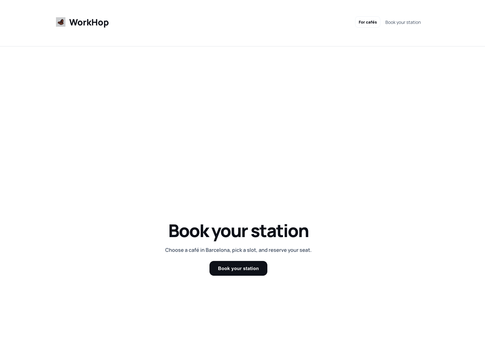
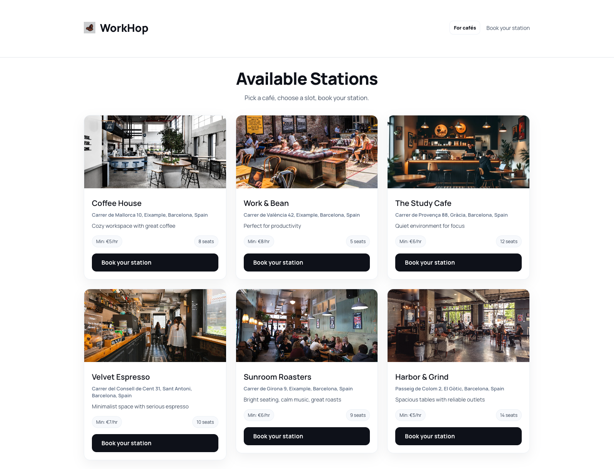
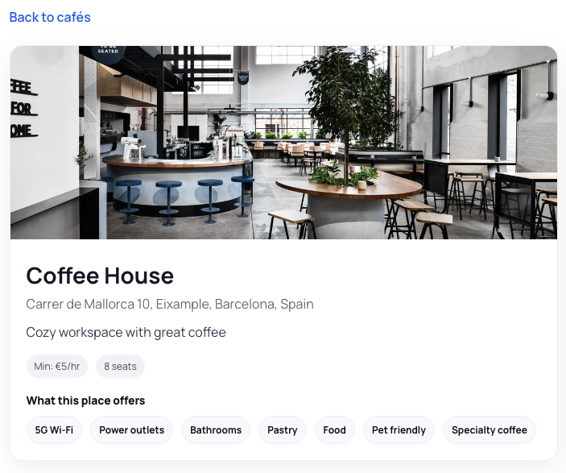
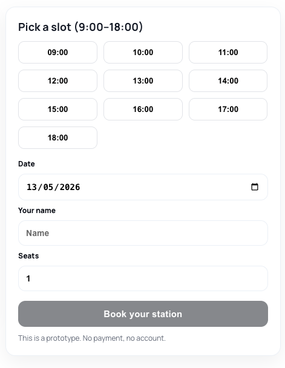
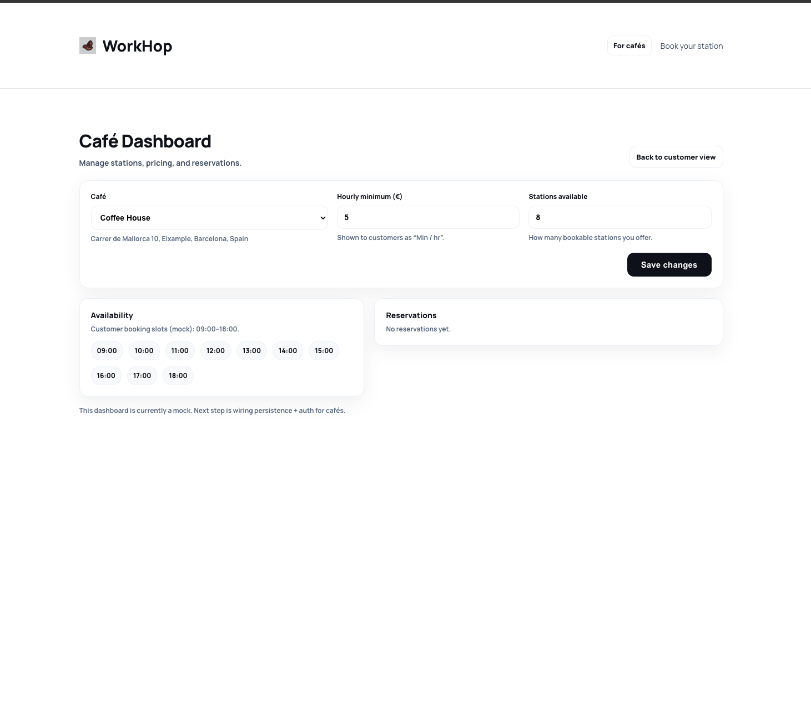
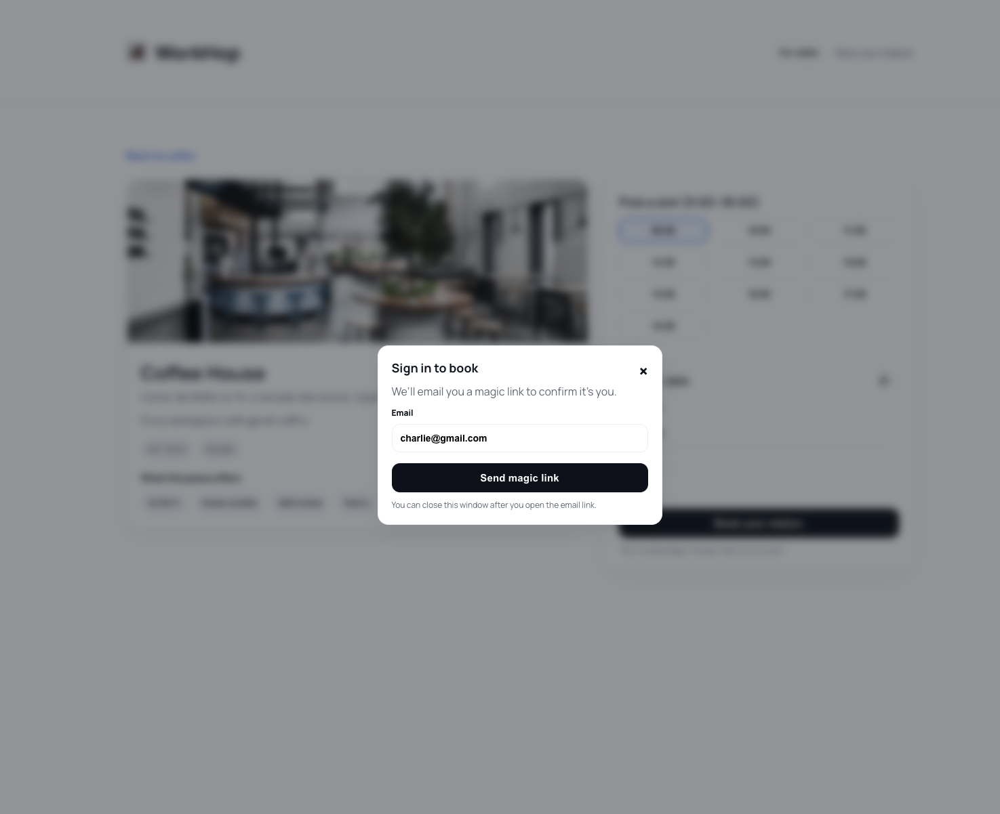

# STATION — Café Workspace Reservation Platform
 
 STATION is a startup-oriented SaaS MVP that helps **remote workers discover cafés** and **reserve work-friendly seats by time slot**, while giving cafés tools to **manage availability** and **reduce the “all-day laptop squat” problem**.
 
 It’s designed as a two-sided product:
 - **Guests (remote workers)** reserve a “station” for a defined time window.
 - **Café owners** control availability, capacity, and reservation operations.
 
 ---
 
 ## Overview
 
 Remote work made cafés a second office — but that comes with friction:
 - guests want reliability (wifi, seating, power, a guaranteed spot)
 - cafés want steady revenue and predictable occupancy
 
 **STATION** connects both sides through **time-based reservations** and a **consumption-based booking model** (e.g., minimum consumption per hour), creating mutual value without turning cafés into co-working spaces.
 
 ---
 
 ## Features
 
 ### Current Features (implemented in the repo today)
 
 - **Café discovery (MVP)**
   - Browse cafés and view basic details.
 - **Availability management (owner-side)**
   - Availability slots per café (date + time) with enable/disable.
 - **Reservation data model**
   - Reservations stored with status (e.g., confirmed/cancelled).
 - **Owner authentication (MVP)**
   - Owner login flow using a server-side passcode (configured via env).
 - **Database + seed workflow**
   - Prisma schema + seed script for local development.
 
 ### Planned Features (in progress / not fully implemented yet)
 
 - **Guest authentication**
   - Email “magic link” sign-in via NextAuth (provider wiring exists; end-to-end UX may still be in progress).
 - **Guest reservation checkout flow**
   - Seat count selection, confirmation, and cancellation UX.
 - **Owner dashboard (premium ops view)**
   - View upcoming reservations, manage slot capacity, and handle exceptions.
 - **Booking validation system**
   - QR / short-code verification for in-café check-in.
 - **Payments / billing**
   - Capture consumption minimums, enforce no-shows, and support platform take-rate.
 - **SaaS multi-tenant admin**
   - Multiple cafés, roles/permissions, audit logs.
 
 ---
 
 ## Product Vision
 
 **Problem:** Remote workers can occupy tables for hours, especially during slow periods. Cafés either:
 - tolerate it and lose table turnover
 - enforce harsh laptop rules and lose loyal customers
 
 **STATION’s approach:** make workspace time explicit and fair.
 - guests reserve with clear expectations (time window, minimum consumption)
 - cafés gain predictable occupancy and a tool to monetize slow hours
 
 ---
 
 ## Current Progress
 
 What’s already in place:
 - **MVP planning and scoping** (see `station-next/memory-bank/`)
 - **Next.js app structure** (routes, pages, server handlers)
 - **Core domain modeling** with Prisma (`Cafe`, `AvailabilitySlot`, `Reservation`)
 - **Owner-side operational flow** foundation (login + availability management)
 - **Local dev workflows** (migrate/seed scripts)
 
 ---
 
 ## Tech Stack (auto-detected)
 
 - **Framework**: Next.js (`station-next/`)
 - **Language**: TypeScript
 - **UI**: React
 - **Auth**: NextAuth (email provider; plus an MVP owner passcode)
 - **Database**: PostgreSQL
 - **ORM**: Prisma
 - **Email**: Resend (verification emails)
 - **Tooling**: ESLint, npm workspaces
 
 ---
 
 ## Project Structure
 
 This repo is an **npm workspaces** monorepo:
 - `station-next/` — the Next.js application (main product)
 - `station-next/prisma/` — Prisma schema, migrations/seed
 - `station-next/src/app/` — app routes (UI + API route handlers)
 
 ---
 
 ## Development Status
 
 STATION is currently in **active MVP development**.
 
 ---
 
 ## Screenshots
 
 
 
 
 
 
 
 
 
 
 
 
 
 ---
 
 ## Installation
 
 Prerequisites:
 - Node.js (recommended: current LTS)
 - PostgreSQL database (local or hosted, e.g. Neon)
 
 ```bash
 npm install
 ```
 
 ---
 
 ## Run Locally
 
 1. Configure environment variables
 
 Copy the example env file:
 
 ```bash
 cp station-next/.env.example station-next/.env.local
 ```
 
 Fill in at least:
 - `DATABASE_URL`
 - `OWNER_PASSCODE`
 - `NEXTAUTH_URL`
 - `NEXTAUTH_SECRET`
 - `RESEND_API_KEY` (only required if you’re testing email auth)
 - `AUTH_EMAIL_FROM` (email sender)
 
 2. Set up the database
 
 ```bash
 npm run db:migrate
 npm run db:seed
 ```
 
 3. Start the dev server
 
 ```bash
 npm run dev
 ```
 
 The app should be available at `http://localhost:3000`.
 
 ---
 
 ## Future Improvements
 
 - **Payments + billing** (consumption-based booking enforcement)
 - **Reservation verification** (QR / short codes)
 - **Better guest experience** (saved cafés, repeat bookings, calendar sync)
 - **Operational tooling for cafés** (analytics, peak-hour strategy, no-show handling)
 - **Multi-tenant SaaS hardening** (roles, permissions, auditing)
 - **Observability** (logging, error tracking) and test coverage
 
 ---
 
 ## Notes on Deployment Readiness (high-level)
 
 The project includes `build`/`start` scripts and a production-ready stack (Next.js + Prisma + Postgres). Deployment is feasible, but not the focus yet.
 Typical next steps later:
 - pick a host (e.g. Vercel)
 - configure production Postgres + environment variables
 - run Prisma migrations in CI/CD
